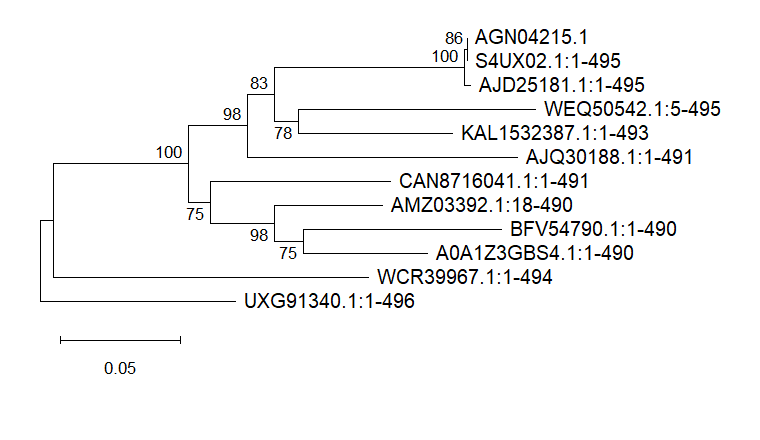
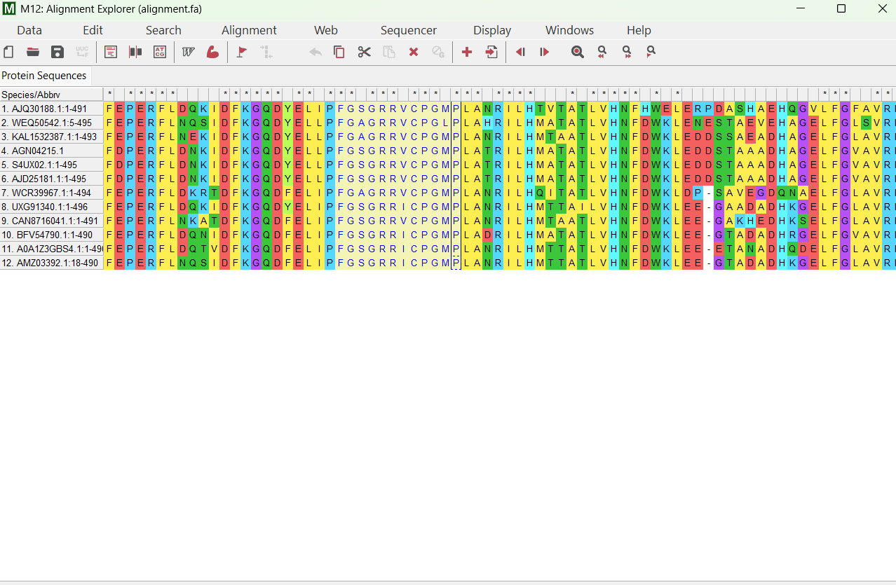
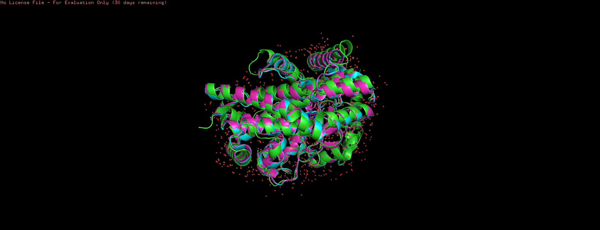
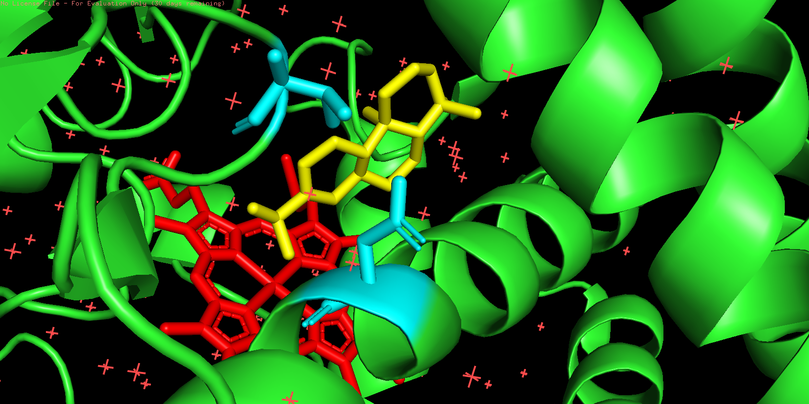

# Plant CYP450 Structural \& Docking Analysis

Computational structural and docking analysis of plant CYP450 enzymes involved in secondary
metabolite biosynthesis, extended to a pharmacogenomics classifier for human drug metabolism
prediction. Developed as a computational extension of wet-lab molecular cloning work performed
at CSIR-Central Drug Research Institute (CDRI), Lucknow, during an INSA-NASI Summer Research
Fellowship (2025) under Dr. Vineeta Tripathi, Principal Scientist.

## Working sequence: CYP76AH1 (ferruginol synthase) from *Salvia miltiorrhiza*
(UniProt S4UX02; GenBank JX422213 / protein AGN04215.1), selected for its functional and
phylogenetic similarity to the *Eclipta prostrata* CYP450 characterised during the fellowship.

## Background
During the fellowship, a CYP450 gene from *Eclipta prostrata* — involved in wedelolactone
biosynthesis — was sub-cloned into pYES2-NTB (yeast) and pCAMBIA1302 (plant/Agrobacterium)
expression vectors. The actual gene sequence belongs to an ongoing PhD project at the lab and
is not publicly available prior to publication. CYP76AH1 from *Salvia miltiorrhiza* was chosen
as a public working sequence for this computational extension because it belongs to the same
CYP76 family involved in terpenoid secondary metabolite biosynthesis, produces bioactive
compounds (tanshinones) with an analogous pharmacological profile to wedelolactone, and has
extensive published structural and docking literature available for validation.

## Phase 1 — Phylogenetics

**Sequence retrieval** The CYP76AH1 protein sequence was retrieved from NCBI Protein
(AGN04215.1), with identity cross-confirmed against UniProt (S4UX02).

**Homology search.** BLASTp was run against the full NCBI non-redundant (nr) protein database.
Eleven homologs were selected to maximise taxonomic and sequence-identity diversity (rather than
top-score alone), spanning 72–99.6% identity across the Lamiaceae family:

| Accession | Species | % Identity |

|---|---|---|

| AJD25181.1 | *S.miltiorrhiza* | 99.6% |

| KAL1532387.1 | *S. divinorum* | 85.4% |

| WEQ50542.1 | *S. officinalis* | 82.9% |

| AJQ30188.1 | *S. rosmarinus* | 81.5% |

| AMZ03392.1 | *Plectranthus barbatus* | 81.7% |

| A0A1Z3GBS4.1 | *Isodon rubescens* | 80.3% |

| BFV54790.1 | *Isodon japonicus* | 79.1% |

| CAN8716041.1 | *Dracocephalum ruyschiana* | 81.3% |

| UXG91340.1 | *Callicarpa americana* | 75.9% |

| WCR39967.1 | *Scutellaria barbata* | 72.8% |

Note: an *Artemisia annua* homolog was considered per the original project outline but excluded —
A. annua's characterised CYP450s (e.g. CYP71AV1) belong to the CYP71 family, not CYP76, and
returned no meaningful BLASTp hits against this query.

**Multiple sequence alignment.** Performed in Clustal Omega (EBI) on the query plus 11 homologs
(12 sequences total, default parameters).

**Phylogenetic tree.** A Neighbour-Joining tree was constructed in MEGA 12 (1000 bootstrap
replicates, Poisson correction, pairwise deletion), rooted at the most divergent taxon
(*Callicarpa americana*). Topology is biologically consistent: the three *S. miltiorrhiza*
sequences cluster tightly (bootstrap 86–100%), followed by a broader *Salvia* clade
(bootstrap 78–98%), with *Scutellaria* and *Callicarpa* as the most divergent outgroup pair.

**Conserved heme-binding motif.** The canonical cytochrome P450 heme-ligand signature
(FxxGxxxCxG) was located at residues 430–439 of the query (`FGSGRRVCPG`), with the
heme-ligating cysteine at residue 437. This motif — and the cysteine in particular — is
100% conserved across all 12 sequences despite up to \~40% overall sequence divergence,
consistent with strong purifying selection on this catalytically essential residue.

**Specificity-residue analysis (D301 / V479).** Mao et al. (2020) showed that mutating two
residues in CYP76AH1 — D301→E and V479→F — shifts product specificity from pure ferruginol
toward the broader product profile of its paralog CYP76AH3. Checking these two positions across
the alignment:

| Accession | Species | Residue 301 | Residue 479 |

|---|---|---|---|

| AGN04215.1 (query) | *S. miltiorrhiza* | D | V |

| S4UX02.1 | *S. miltiorrhiza* | D | V |

| AJD25181.1 | *S. miltiorrhiza* | D | V |

| BFV54790.1 | *Isodon japonicus* | D | V |

| AJQ30188.1 | *S. rosmarinus* | E | F |

| WEQ50542.1 | *S. officinalis* | E | L |

| KAL1532387.1 | *S. divinorum* | E | L |

| WCR39967.1 | *Scutellaria barbata* | E | L |

| UXG91340.1 | *Callicarpa americana* | E | L |

| CAN8716041.1 | *Dracocephalum ruyschiana* | E | L |

| A0A1Z3GBS4.1 | *Isodon rubescens* | E | L |

| AMZ03392.1 | *Plectranthus barbatus* | E | L |

D301 and V479 co-occur perfectly across the dataset with zero exceptions: only the three
*S. miltiorrhiza* sequences and one *Isodon japonicus* homolog retain both wild-type residues,
while every other genus — including close *Salvia* relatives — has independently drifted to
the alternate pair at both positions simultaneously. This suggests the two residues co-evolve
as a functional unit, and that strict single-product (ferruginol-only) specificity may be
restricted to a narrow clade within the broader CYP76 family.

## Phase 2 — Structure Prediction & Validation (ColabFold/PyMOL)

**Structure prediction.** The CYP76AH1 sequence was submitted to ColabFold (AlphaFold2, MMseqs2
MSA mode) for 3D structure prediction. The top-ranked model achieved high confidence:
**pLDDT = 90.7, pTM = 0.89** (averaged across 3 recycles), with per-residue pLDDT mostly in the
80-95 range across all 5 generated models — indicating a reliably folded core structure, with
only isolated flexible loop regions dropping to lower confidence (50-60).

**Validation against experimental structures.** The predicted structure was aligned in PyMOL
against two published crystal structures of CYP76AH1 from *Salvia miltiorrhiza*: PDB 5YLW
(apo form) and PDB 7CB9 (in complex with heme and its natural substrate, miltiradiene). The
AlphaFold2 prediction superimposed with excellent agreement onto both:

| Reference structure | RMSD | Atoms aligned |
|---|---|---|
| 5YLW (apo) | 0.919 Å | 3015 |
| 7CB9 (substrate-bound) | 0.908 Å | 2993 |

Sub-1 Å RMSD against both experimental structures confirms the predicted model is structurally
reliable for downstream analysis.

**Active site visualization.** Using the substrate-bound structure (7CB9), the heme group
(HEM) and bound miltiradiene substrate (ligand code J6C) were visualized alongside the two
specificity-determining residues identified in Phase 1 (D301, V479). Both residues were
confirmed, by direct residue identity check in PyMOL, to retain the same numbering as the
query sequence (no offset between crystal structure and UniProt/GenBank numbering). Both
residues sit at the edge of the substrate-binding pocket, immediately adjacent to the bound
miltiradiene — a direct structural explanation for why mutating either position
(D301E/V479F) alters the enzyme's product specificity (Mao et al., 2020).

## Status

[x] Phase 1: Phylogenetics

[x] Phase 2: Structure prediction (ColabFold) and comparison to experimental structures

&#x20;     (PDB 5YLW, 7CB9)

[ ] Phase 3: Molecular docking (tanshinone IIA, wedelolactone, cryptotanshinone)

[ ] Phase 4: Pharmacogenomics — CYP2D6 metaboliser-phenotype classifier

## References
1.Mao, Y. et al. (2020). Functional Integration of Two CYP450 Genes Involved in
   Biosynthesis of Tanshinones for Improved Diterpenoid Production by Synthetic Biology.
   *ACS Synthetic Biology*, 9(7). https://doi.org/10.1021/acssynbio.0c00136.
2. UniProt: S4UX02 (CYPH1\_SALMI)
3. NCBI: JX422213 / AGN04215.1

